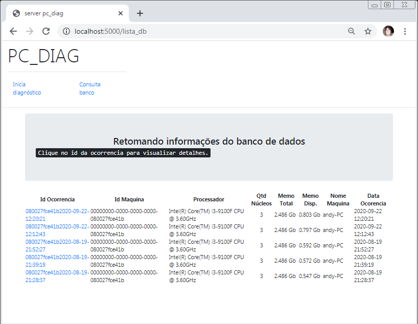
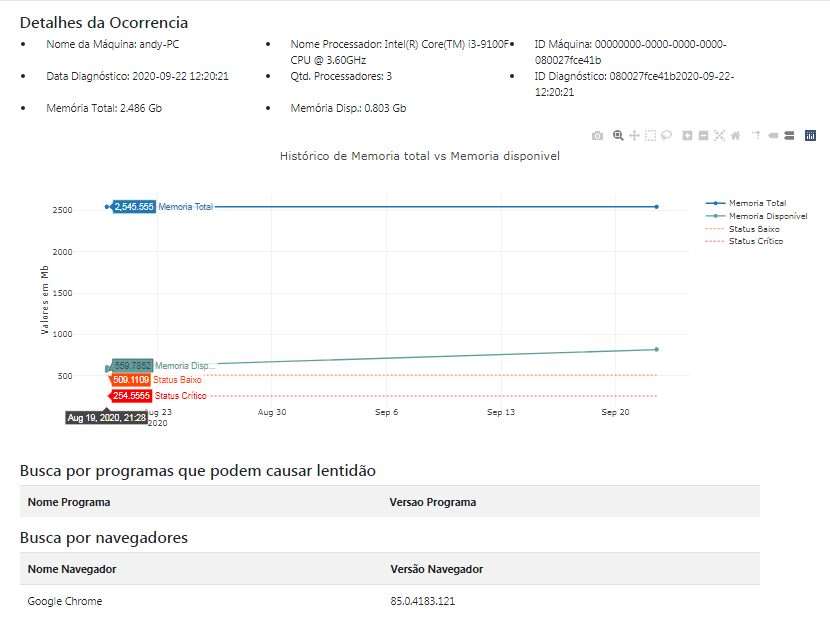
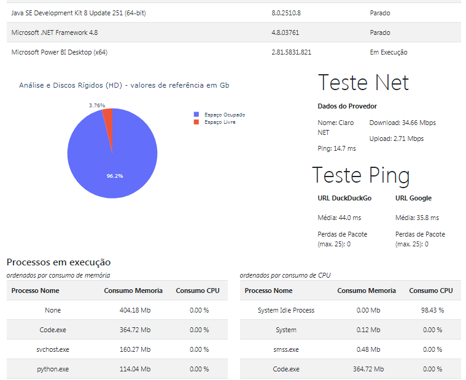

# pypc_diag_server

Web server for viewing and analyzing data generated by the pypc_diag application.

    

    
    

## Passos para iniciar servidor:

1. pip install pipenv

2. ative um novo ambiente virtual usando o comando `pipenv shell` e instale 
as dependências com `pipenv install`

3. execute o arquivo com o comando `python flask_app.py`

obs. Caso encontre problemas de criptografia ao tentar acessar o banco de dados basta editar o arquivo flask_app.py e atualizar as informações de configuração pela variável `app.config['SQLALCHEMY_DATABASE_URI']`
